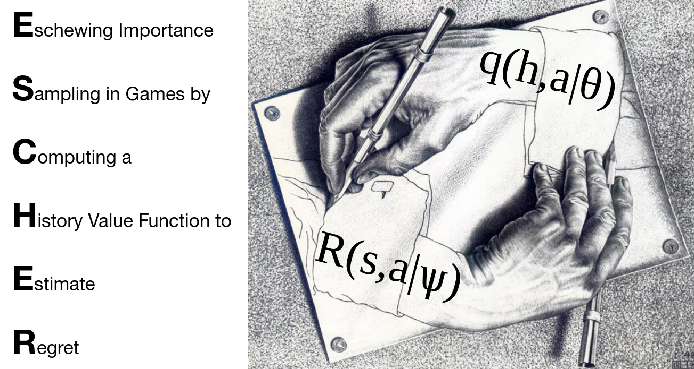

# ESCHER: Eschewing Importance Sampling in Games by Computing a History Value Function to Estimate Regret


Code for Eschewing Importance Sampling in Games by Computing a History Value Function to Estimate Regret (ESCHER).

ESCHER is an unbiased model-free method for finding approximate Nash equilibria in large two-player zero-sum games that does not require any importance sampling. ESCHER is principled and is guaranteed to converge to an approximate Nash equilibrium with high probability in the tabular case. 

We find that ESCHER outperforms the prior state of the art—DREAM and neural fictitious self play (NFSP)—and the difference becomes dramatic as game size increases.

ESCHER requires [open_spiel](https://github.com/deepmind/open_spiel) and, optionally, [ray.](https://github.com/ray-project/ray). 
Instructions for installing both are [here.](https://github.com/indylab/nxdo/blob/master/docs/install.md)

For more information about ESCHER, please see [our paper.](https://arxiv.org/abs/2206.04122)

## Citation
```
@article{mcaleer2022escher,
  title={ESCHER: Eschewing Importance Sampling in Games by Computing a History Value Function to Estimate Regret},
  author={McAleer, Stephen and Farina, Gabriele and Lanctot, Marc and Sandholm, Tuomas},
  journal={arXiv preprint arXiv:2206.04122},
  year={2022}
}
```